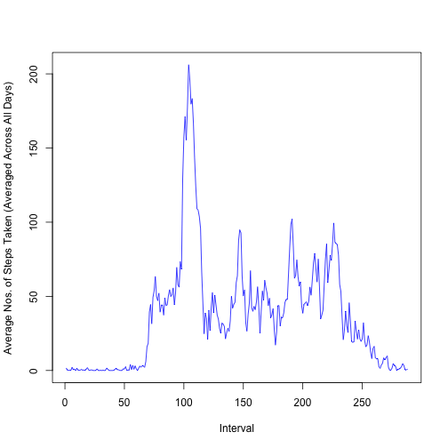
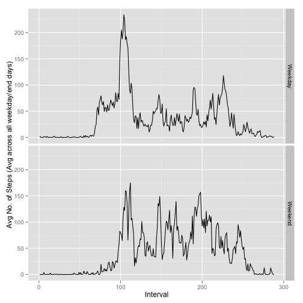

# Loading and preprocessing the data


```r
library(knitr)
#Prepares the file for download and read to table
unzip("repdata-data-activity.zip") #unzip the file above to working directory
```

```
## Warning in unzip("repdata-data-activity.zip"): error 1 in extracting from
## zip file
```

```r
activity_table<-read.csv("activity.csv",sep = ",",h=T) #create the table
```

```
## Warning in file(file, "rt"): cannot open file 'activity.csv': No such file
## or directory
```

```
## Error in file(file, "rt"): cannot open the connection
```

#What is mean total number of steps taken per day?

```r
meantotal_steps<-sapply(split(activity_table$steps,activity_table$date),sum,na.rm=TRUE)
hist(meantotal_steps,xlab="Total Number of Steps each day",main="Frequency of Total Number of Steps each day",ylim=c(0,30))
```

 

```r
#calculate the mean and media
meantotal_steps_table<-as.data.frame(meantotal_steps)
colnames(meantotal_steps_table)<-c("total_steps")
Mean_Steps<-mean(meantotal_steps_table$total_steps)
Median_Steps<-median(meantotal_steps_table$total_steps)
```
##2) The mean total number of steps each day is 9,354.23.
##The median total number of steps each day is 10,395.

# What is the average daily activity pattern?
##1) Make a time series plot (i.e. type = "l") of the 5-minute interval (x-axis) and the average number of steps taken, averaged across all days (y-axis)

```r
#prepare data frame to calculate the avg number of steps taken (averaged across all days) across the unique time interval
activity_table<-read.csv("activity.csv",sep = ",",h=T) #create the table
```

```
## Warning in file(file, "rt"): cannot open file 'activity.csv': No such file
## or directory
```

```
## Error in file(file, "rt"): cannot open the connection
```

```r
activity_table$interval<-as.factor(activity_table$interval) #factorize the interval for plotting
interval_avgsteps_agg<-aggregate(activity_table$steps~activity_table$interval,FUN=mean,na.rm=T)
colnames(interval_avgsteps_agg)<-c("interval","avg_steps")

interval_avgsteps_agg$interval<-as.integer(interval_avgsteps_agg$interval) #change to integer so that lines can be drawn
plot(interval_avgsteps_agg$interval,interval_avgsteps_agg$avg_steps,type="l",col="blue",xlab="Interval",ylab="Average Nos. of Steps Taken (Averaged Across All Days)")
```

 

```r
#to find the 5-min interval with the maximum number os steps
max_steps<-max(interval_avgsteps_agg$avg_steps)
max_stepsinterval<-interval_avgsteps_agg[interval_avgsteps_agg$avg_steps%in%max_steps,1]
```
##2) The 5-minute interval containing the maximum number of steps is 835 (averaged across all the days in the dataset).

#Inputing missing values
##1) Calculate and report the total number of missing values in the dataset (i.e. the total number of rows with NAs)

```r
number_rows<-nrow(activity_table)
number_na<-sum(is.na(activity_table))
```
##The total number of missing rows is 2,304.

##2)Devise a strategy for filling in all of the missing values in the dataset. The strategy does not need to be sophisticated. For example, you could use the mean/median for that day, or the mean for that 5-minute interval, etc.

##Answer: If the missing values are not exceptional outliers that will distort the overall result, mean by each of the 5-minute interval would be a preferred method.

##3) Create a new dataset that is equal to the original dataset but with the missing data filled in.

```r
activity_table<-read.csv("activity.csv",sep = ",",h=T) #create the table
```

```
## Warning in file(file, "rt"): cannot open file 'activity.csv': No such file
## or directory
```

```
## Error in file(file, "rt"): cannot open the connection
```

```r
activity_table$interval<-as.factor(activity_table$interval) #factorize the interval for plotting
activity_table2<-activity_table[!is.na(activity_table$steps),] #create a new table removing the NA
activity_table3<-activity_table #create a new table that includes the NA
date_avgsteps_agg<-aggregate(activity_table2$steps, by=list(activity_table2$date,activity_table2$interval),FUN=mean,na.rm=T)
colnames(date_avgsteps_agg)<-c("date","interval","steps")
activity_table2$unique<-paste(activity_table2$date, "_",activity_table2$interval) #create unique identifier with date and interval
activity_table3$unique<-paste(activity_table3$date, "_",activity_table3$interval) #create unique identifier with date and interval
date_avgsteps_agg$unique<-paste(date_avgsteps_agg$date,"_",date_avgsteps_agg$interval) #create unique identifier with date and interval

#match the unique identifider with activity_table3's identifier and if they match, paste the row/s to activity_table3
for (i in 1:nrow(date_avgsteps_agg)){
if (grep(date_avgsteps_agg$unique[i],activity_table3$unique)>0)
 rbind(date_avgsteps_agg[i,], activity_table3)
}
```

##4) Make a histogram of the total number of steps taken each day and calculate and report the mean and median total number of steps taken per day. Do these values differ from the estimates from the first part of the assignment? What is the impact of imputing missing data on the estimates of the total daily number of steps?

```r
meantotal_steps2<-sapply(split(activity_table3$steps,activity_table3$date),sum,na.rm=TRUE)
hist(meantotal_steps2,xlab="Total Number of Steps each day",main="Frequency of Total Number of Steps each day",ylim=c(0,30))
```

 

```r
#calculate the mean and media
meantotal_steps_table2<-as.data.frame(meantotal_steps2)
colnames(meantotal_steps_table2)<-c("total_steps")
Mean_Steps2<-mean(meantotal_steps_table2$total_steps)
Median_Steps2<-median(meantotal_steps_table2$total_steps)
```
##Mean = 9,354.23 and Median = 10,395.
##Both mean and median remain the same as we added the mean by interval, which is not expected to affect the results.

#Are there differences in activity patterns between weekdays and weekends?
##1) Create a new factor variable in the dataset with two levels – “weekday” and “weekend” indicating whether a given date is a weekday or weekend day.

```r
activity_table3$day<-as.POSIXct(strptime(activity_table3$date, "%Y-%m-%d"))
activity_table3$day<-weekdays(activity_table3$day)
activity_table3$day<-as.character(activity_table3$day)

for (i in 1:nrow(activity_table3)){
if(activity_table3$day[i]%in%c("Saturday","Sunday"))
  activity_table3$day[i]<-"Weekend"
  else
  activity_table3$day[i]<-"Weekday"
}
activity_table3$interval<-as.factor(activity_table3$interval) #factorize the interval for plotting
interval_avgsteps_agg2 <-aggregate(activity_table3$steps,by=list(activity_table3$interval,activity_table3$day),FUN=mean,na.rm=T)
colnames(interval_avgsteps_agg2)<-c("interval","day","avg_steps")
```
##2)Make a panel plot containing a time series plot (i.e. type = "l") of the 5-minute interval (x-axis) and the average number of steps taken, averaged across all weekday days or weekend days (y-axis). See the README file in the GitHub repository to see an example of what this plot should look like using simulated data.

```r
library(ggplot2)
interval_avgsteps_agg2$interval<-as.integer(interval_avgsteps_agg2$interval)#change to integer so that lines can be drawn
qplot(interval,avg_steps, data=interval_avgsteps_agg2,facets=day~.,xlab="Interval",ylab="Avg No. of Steps (Avg across all weekday/end days)",geom=c("line"))
```

 
